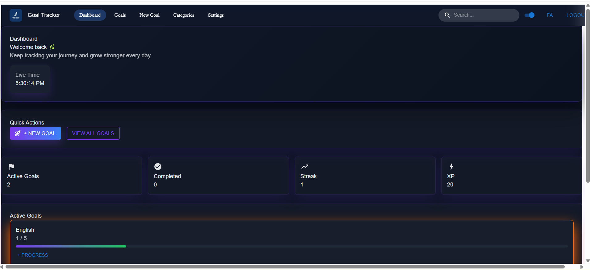
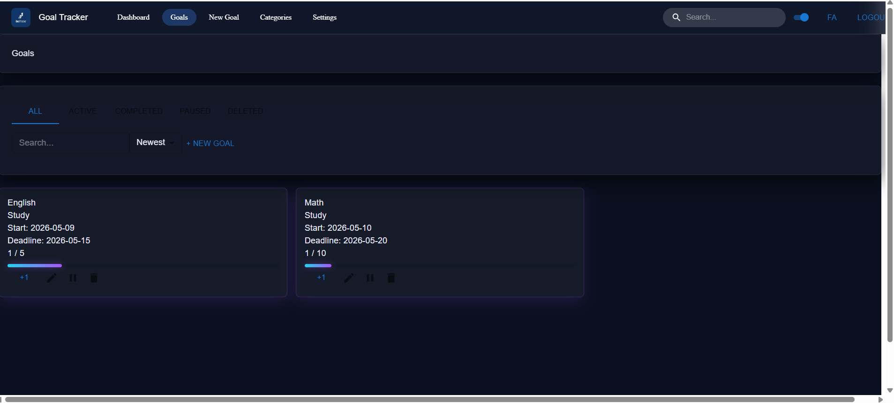
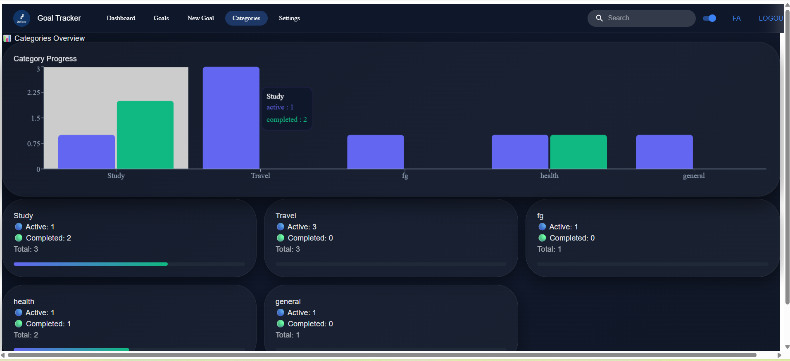
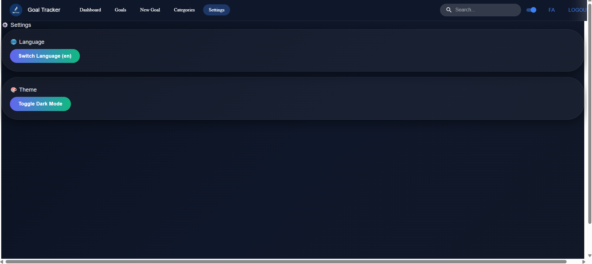
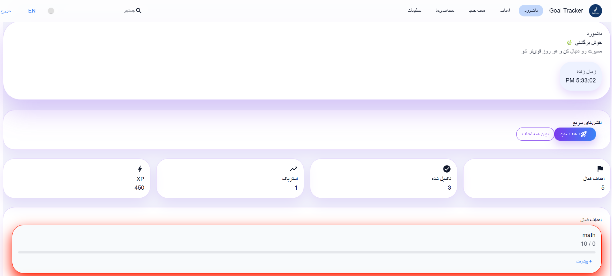

````md
# 📊 Goal Tracker Dashboard

A modern React-based Goal Tracker web application built with Vite.  
It allows users to create, manage, and track personal goals with progress, XP, streaks, and categories. The app also supports **multi-language (English + Persian/Arabic)** with **RTL/LTR layout switching**.

---

## 🚀 Live Demo
https://github.com/codewithKhatera/goaltracker-

---

## ⚙️ Tech Stack

- React (Vite)
- React Router DOM
- Context API / Redux Toolkit (optional depending on your implementation)
- LocalStorage (data persistence)
- MUI / Tailwind (UI styling)
- React Icons

---

## ✨ Features

### 📌 Goal Management (CRUD)
- Create goals
- Read / view goals
- Update goals
- Delete goals (with confirmation)

### 📊 Progress Tracking
- Add daily progress logs
- Auto-calculate progress percentage
- Auto-mark goal as completed when target is reached

### 🔥 Gamification System
- XP system (+20 XP per progress update)
- Streak tracking (consecutive active days)
- Level/progress motivation system (optional)

### 📂 Categories System
- Health
- Study
- Work
- Personal
- Custom categories

### 📋 Goal Status
- Active
- Paused
- Completed

---

## 🌐 Multi-language Support

- English (LTR)
- Persian / Arabic (RTL)

### Features:
- Full UI text translation
- Layout direction switching (LTR ↔ RTL)
- Works across all pages

---

## 📊 Dashboard Features

- Overall completion percentage
- Total completed goals
- XP points display
- Streak counter
- Quick actions:
  - Add new goal
  - View all goals

---

## 🧠 Data Model

```js
{
  id: "",
  title: "",
  category: "",
  type: "daily | count | time",
  target: 0,
  progress: 0,
  status: "active | paused | completed",
  startDate: "",
  endDate: "",
  logs: [
    {
      date: "",
      amount: 0
    }
  ],
  createdAt: "",
  updatedAt: ""
}
````

---

## 📁 Project Structure

```id="k6z7m2"
src/
 ├── components/
 ├── pages/
 ├── context/
 ├── redux/
 ├── utils/
 ├── App.jsx
 └── main.jsx
```

---

## 🖼️ Screenshots


### 📌 Image Naming Convention:

* image1.png → Dashboard
* image2.png → Goals Page
* image3.png → Create Goal
* image4.png → Goal Details
* image5.png → Mobile View

---

### 📸 Preview

#### 🏠 Dashboard



#### 📋 Goals Page



#### ➕ Create Goal


#### 📊 Goal Details



#### 📱 Mobile View



---
#### 📱 Mobile View



#### 📱 Mobile View


## ⚙️ Installation & Run

```bash id="m1v8qk"
npm install
npm run dev
```

---

## 🔥 Streak System

* Streak increases when user logs progress on consecutive days
* Streak resets if a day is missed

---

## 💰 XP System

* Each progress update = +20 XP
* XP is displayed on dashboard
* Used for motivation system

---

## 📌 Pages (Routing)

* `/dashboard` → Main dashboard
* `/goals` → All goals
* `/goals/new` → Create goal
* `/goals/:id` → Goal details
* `/categories` → Categories overview
* `/settings` → Language + theme settings

---

## 🧠 Key Features Summary

✔ Full CRUD system
✔ Progress tracking
✔ XP + streak system
✔ Multi-language support
✔ RTL/LTR switching
✔ Responsive design
✔ LocalStorage persistence

---

## 🏆 Bonus Features (If Implemented)

* Charts for progress visualization
* Dark/Light theme
* Animations
* Goal filtering & sorting
* Confirm modals
* Empty states UI

---

## 👩‍💻 Author

Goal Tracker Dashboard – Week 6 Assignment Project

```

